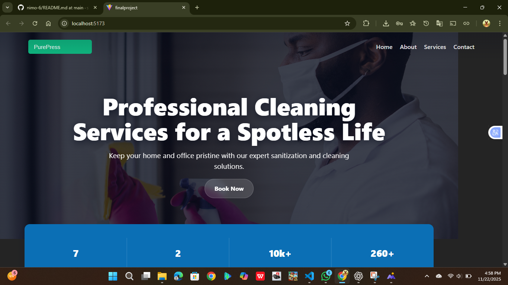
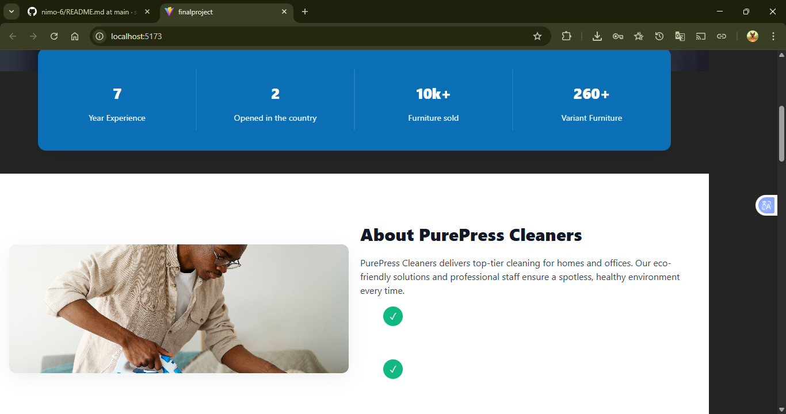
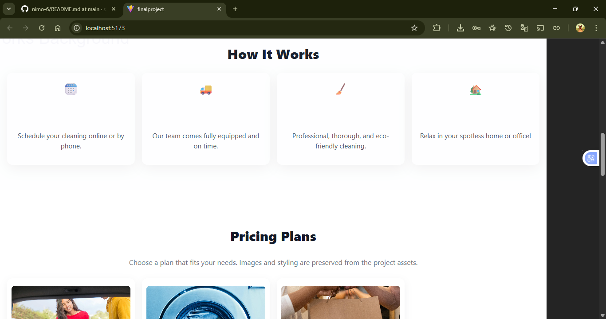
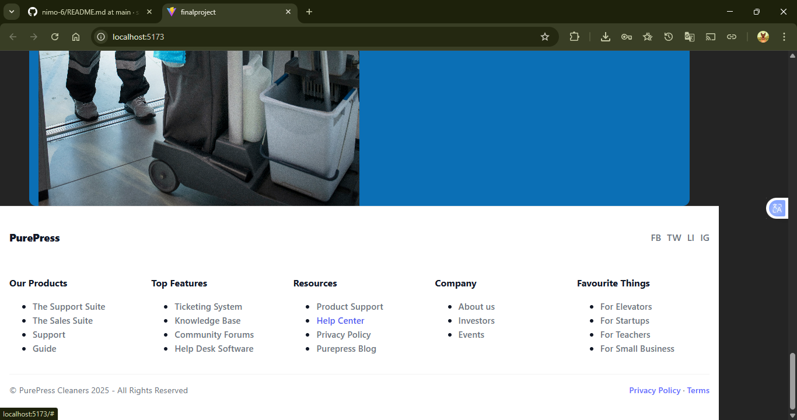

# nimo-6
PurePress Cleaners  PurePress Cleaners is  example of professional responsive website that combines good design clear brand identity and easy navigation. It is well-structured, fast, accessible,and easy to maintain This description uses simple words and is around 350 words, explaining the main features and purpose of the PurePress Cleaners website.
## 📸 Screenshots

### 🔹 Large Screen (LG)

### 🔹 Medium Screen (MD)

### 🔹 Small Screen (SM)

### 🔹 Lighthouse Score

